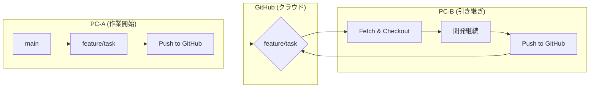

# 複数PCでのGit運用術：安全に開発を引き継ぐ「3つの鉄則」とブランチ活用ガイド

職場と自宅、メインPCとサブPCなど、複数のパソコンで1つのプロジェクトを開発する際、「あっちのPCでの変更が反映されていない」「ファイルが競合（Conflict）してしまった」といったトラブルは誰もが経験する道です。

この記事では、**複数PC間で安全かつスムーズに開発を引き継ぐための「3つの鉄則」**と、プロの現場でも使われる**「ブランチ（枝）」を活用したワークフロー**を分かりやすく解説します。

---

## 複数PC開発を成功させる「3つの鉄則」

トラブルを未然に防ぐため、毎日のルーティンとして以下の3要素をセットにしましょう。

### 1. 開発を「始める前」に、必ず `git pull` する
> [!IMPORTANT]
> **「まずは Pull」が最大の防御です。**
> もう一方のPCで進めた変更を取り逃がしたままコードを書き始めると、後で競合が発生し、その解消に多大な時間を奪われます。コーヒーを淹れる前に、まずはコマンドを叩きましょう。

```bash
# ターミナルを開き、最新の状態をGitHubから取り込む
git pull origin main
```

### 2. 作業が一段落したら `git push` する
> [!TIP]
> **「動く状態」で細かく Push しましょう。**
> エラーが出たまま放置せず、一つの機能が動いた、あるいはキリが良いタイミングで GitHub に反映させます。これが「別の PC へのバトン」になります。

```bash
git add .
git commit -m "feat: 〇〇機能の基本レイアウトを実装"
git push origin main
```

### 3. 本格的な作業は「ブランチ（Branch）」で隔離する
`main` ブランチ（本番用のコード）を直接いじらず、作業専用の「枝（ブランチ）」を作るのがベストプラクティスです。万が一作業中に混乱しても、`main` さえ無事ならいつでもやり直せます。

---

## 図解：ブランチを使った同期の流れ

ブランチを使うと、以下のように PC 間で安全にコードを同期できます。



---

## 実践：スムーズな開発サイクル 5ステップ

### ステップ1：作業用ブランチの作成（PC-A）
まずは `main` から枝分かれした、作業専用のブランチを作ります。

```bash
git checkout -b feature/new-feature
```
*   `-b` オプション：ブランチの作成と切り替えを同時に行います。
*   名前の例： `feature/login-ui`, `bugfix/fix-header` など。

### ステップ2：開発と保存（PC-A）
ファイルを編集したら、そのブランチに対してコミットします。

```bash
git add .
git commit -m "docs: 説明文の追加"
```

### ステップ3：GitHubへのアップロード（PC-A）
作成したブランチを GitHub に送信します。

```bash
git push origin feature/new-feature
```

### ステップ4：別のPCで引き継ぎ（PC-B）
別の PC に移動したら、新しいブランチの情報を「取得」して「切り替え」ます。

```bash
# 1. GitHubの最新情報を読み込む（この時点ではまだファイルは変わりません）
git fetch origin

# 2. 作業中のブランチに切り替える
git checkout feature/new-feature
```
> [!NOTE]
> `fetch` と `pull` の違い：
> *   `fetch`: GitHub から最新情報を「見にいく」だけ（安全）。
> *   `pull`: `fetch` した内容を現在のファイルに「流し込む」（同期）。

### ステップ5：完成したら統合（Merge）
作業がすべて完了し、動作確認も済んだら `main` に合流させます。

```bash
# 1. main ブランチに戻る
git checkout main

# 2. 合流前に main を最新にしておく
git pull origin main

# 3. 作業ブランチを main に統合する
git merge feature/new-feature

# 4. 統合された最新の main を GitHub に反映！
git push origin main
```

---

## まとめ：これだけは覚えたい作業フロー

迷ったらこのカンニングペーパーを見てください。

1.  **PC-A**: `pull` ➡ ブランチ作成 ➡ 開発 ➡ `push`
2.  **PC-B**: `fetch` ➡ ブランチ切り替え ➡ 開発 ➡ `push`
3.  **完了**: `main` へ戻る ➡ `merge` ➡ `main` を `push`

このリズムを意識すれば、複数 PC での開発も、将来のチーム開発も怖くありません。快適な Git ライフを！
